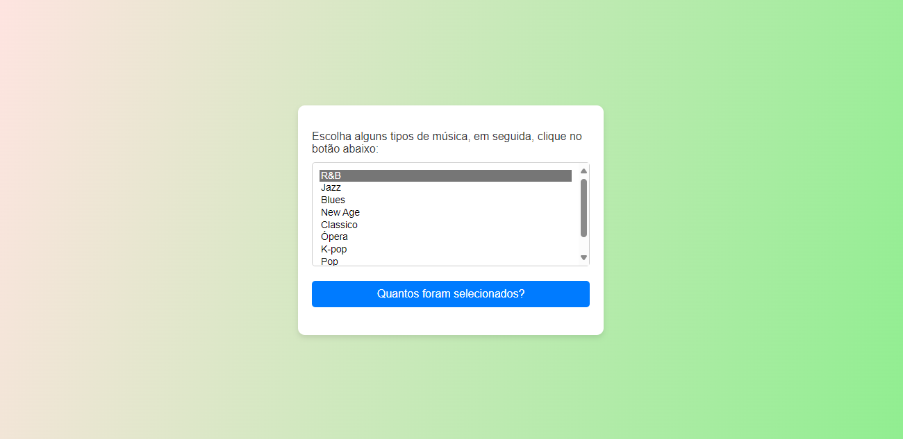

# ÍNDICE

* [Descrição](#descrição)
* [Introdução](#introdução)
* [Funcionalidades](#funcionalidades)
* [Calendário](#calendário)
* [Tecnologias Utilizadas](#tecnologias-utilizadas)
* [Referências](#referências)
* [Autores](#autores)

# Laços e Iterações

## Descrição 📒
Este projeto é um exemplo simples de um formulário HTML com uma caixa de seleção de múltiplas opções. O objetivo é permitir que o usuário selecione diferentes tipos de música e, ao clicar em um botão, exiba o número de opções selecionadas. O design da página utiliza um fundo em degradê com cores harmoniosas e uma estilização CSS moderna para o formulário e os elementos interativos.

## Introdução 📖
O projeto é composto por um arquivo HTML que estrutura o formulário e um arquivo CSS que aplica a estilização desejada. Também inclui um script JavaScript que conta e exibe o número de opções selecionadas na caixa de seleção.

## Página 👨‍💻

## Funcionalidades ⚙️
- Seleção de múltiplas opções: Permite ao usuário selecionar vários tipos de música de uma vez.
- Contagem de seleções: Um botão que, ao ser clicado, exibe um alerta com o número total de opções selecionadas.
- Estilização moderna: Utiliza um fundo em degradê com cores suaves (rosa claro e verde claro) e um design limpo e atraente para o formulário.

## Tecnologias Utilizadas 💻
- HTML5: Para a estruturação do conteúdo da página.
- CSS3: Para a estilização da página, incluindo um fundo em degradê, bordas arredondadas e efeitos de sombra.
- JavaScript: Para a funcionalidade de contar e exibir o número de opções selecionadas.

## Referências 📝
- 

## Autor 👤
- João Pedro Gonçalves